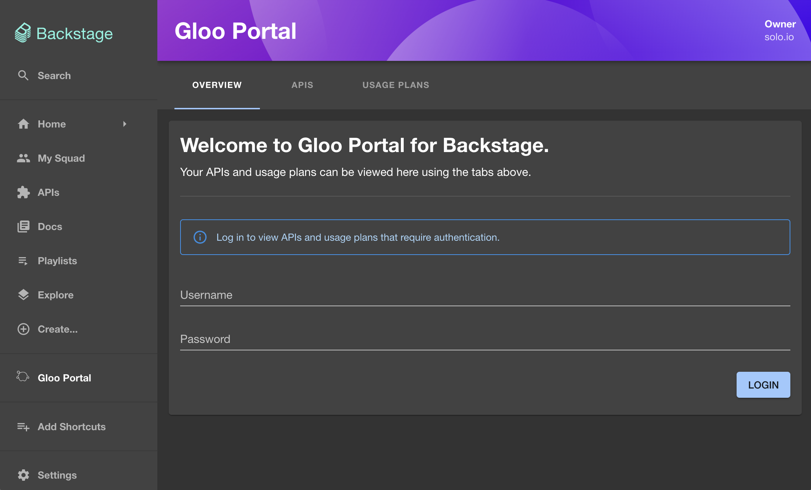
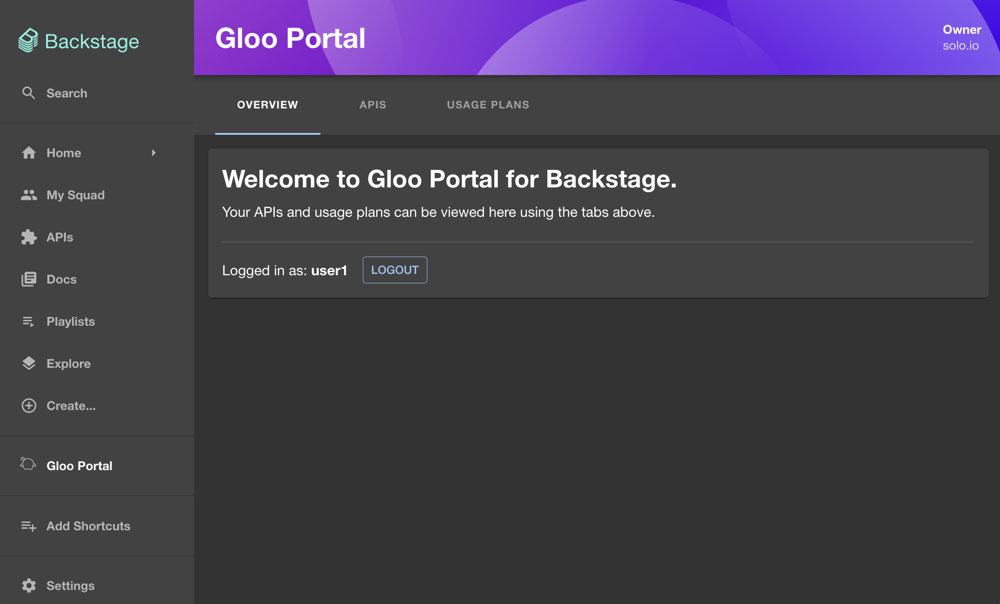
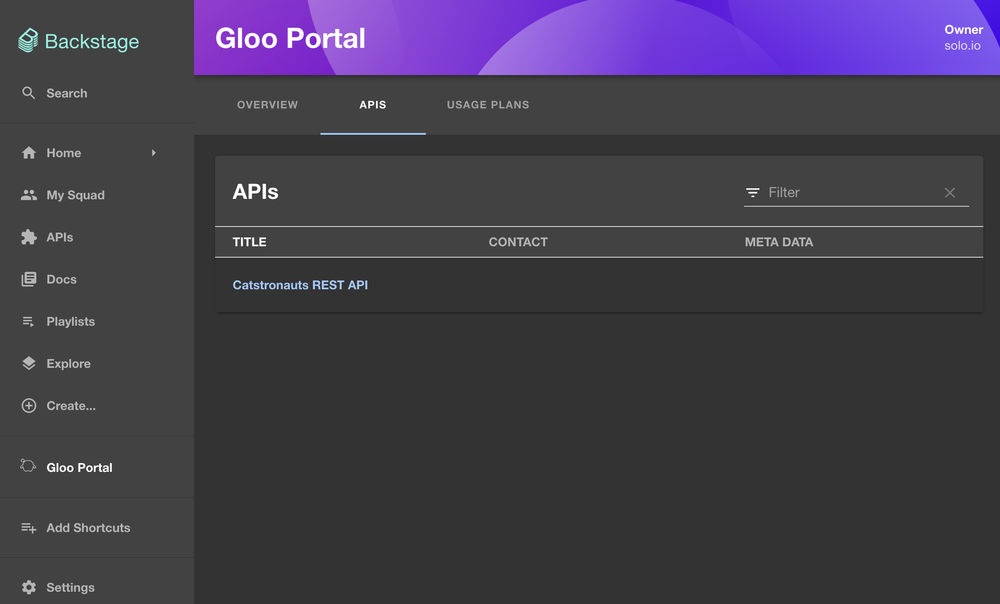
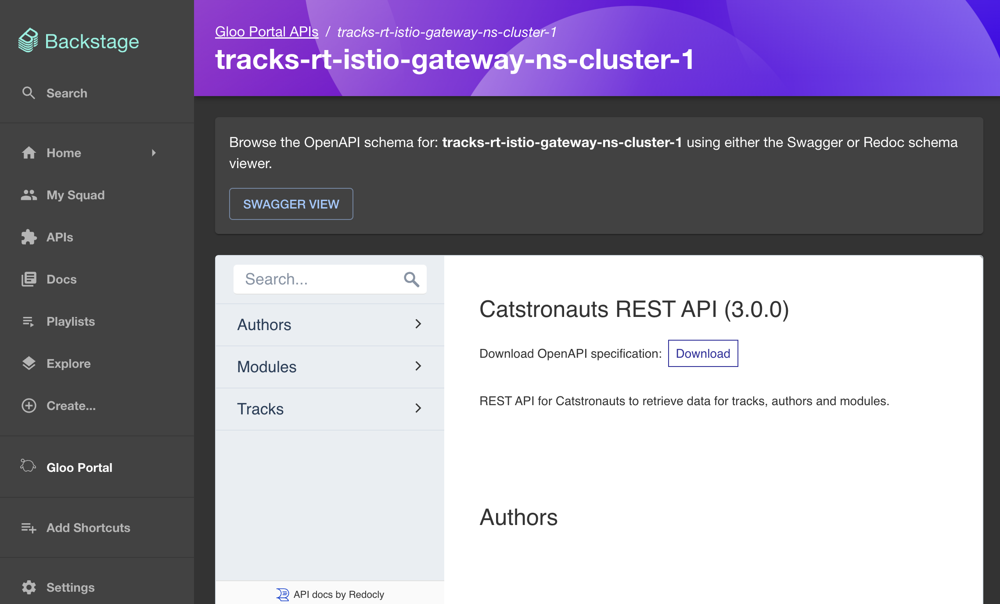

# Gloo Portal Backstage Plugin

# Background

As a part of [Gloo Platform](https://www.solo.io/products/gloo-platform/), [Gloo Portal](https://www.solo.io/products/gloo-portal/) provides a Kubernetes-native framework for managing the definitions of APIs, API client identity, and API policies that enables GitOps and CI/CD workflows. The portal abstracts the complexity and enables developers to publish, document, share, discover, and use APIs.

The Gloo Portal Backstage plugin provides an interface for teams to manage, secure, and share APIs. This functionality is enabled through Gloo Portal's built in REST API, and configurable ext-auth policies.

[See a demo of Gloo Platform Portal in action here](https://www.youtube.com/watch?v=YL1aqjZDqGQ)

## Backstage Plugin Features

- View OpenAPI docs for your Gloo Portal APIs using Swagger UI and Redoc UI.
- View details about your Gloo Portal API usage plans.
- View, create, and delete API keys for any of your usage plans.

## Setup

1. Install the [Gloo Portal Backstage plugin](https://www.npmjs.com/package/@solo.io/dev-portal-backstage-plugin) into your Backstage app:

```bash
yarn add --cwd packages/app @solo.io/dev-portal-backstage-plugin
```

<!-- 3. Run `yarn install` from the Backstage root folder. -->

2. In `./packages/app/src/App.tsx`, add these imports at the top of the file:

```tsx
import { GlooPortalHomePage } from "@solo.io/dev-portal-backstage-plugin";
// eslint-disable-next-line monorepo/no-internal-import
import { GlooPortalApiDetailsPage } from "@solo.io/dev-portal-backstage-plugin/src/plugin";
```

Then add these routes to the `<FlatRoutes/>` element in that file:

```tsx
<Route path="/gloo-portal" element={<GlooPortalHomePage />} />
<Route path="/gloo-portal/apis" element={<GlooPortalHomePage />} />
<Route path="/gloo-portal/usage-plans" element={<GlooPortalHomePage />} />
<Route
  path="/gloo-portal/apis/:apiId"
  element={<GlooPortalApiDetailsPage />}
/>
```

5. In `./packages/app/src/components/Root/Root.tsx`, add these imports to the top of the file:

```tsx
import { GlooIcon } from "@solo.io/dev-portal-backstage-plugin";
```

Then add this to the `<SidebarScrollWrapper/>` element in that file.

```tsx
<SidebarItem icon={GlooIcon} to="gloo-portal" text="Gloo Portal" />
```

### Screenshots

Logged out view:



Logged in view:



Viewing a list of APIs:



Viewing an API using an OpenAPI schema viewer:



Viewing API usage plans:


Generating a new API key under a usage plan:


